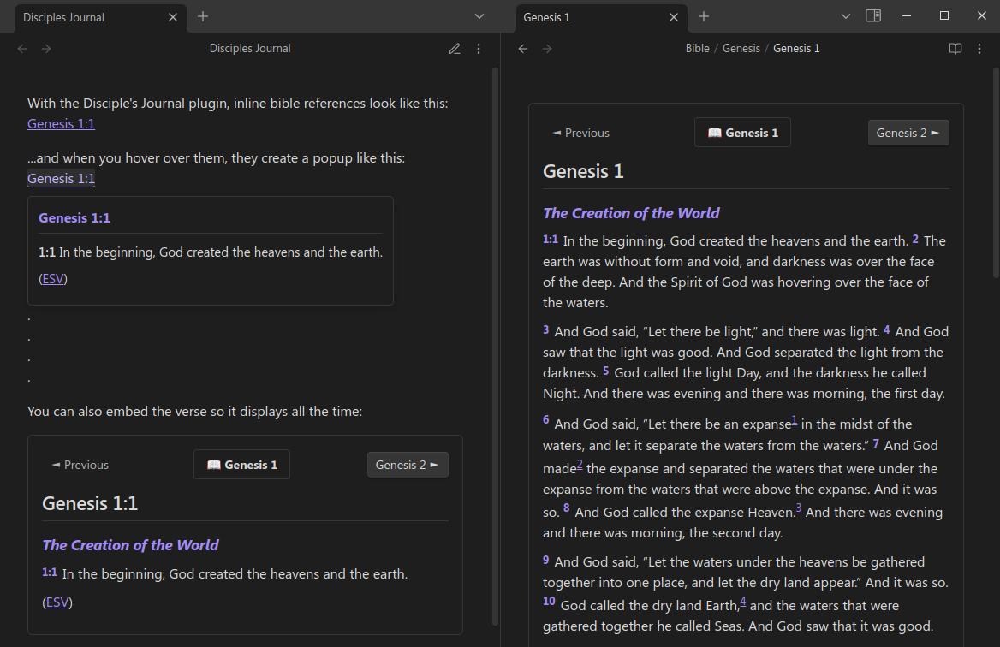

# Disciples Journal - Bible Verse Reference Plugin for Obsidian

This plugin enhances your Bible study and journaling in Obsidian by rendering Bible verse references and passages directly in your notes.



## Features

### Inline Verse References

Type a Bible reference in an inline code block:

```
`Genesis 1:1`
```

The plugin transforms it into a clickable link that:
- **Shows a preview** of the verse text on hover
- **Opens or creates** a chapter note when clicked, automatically scrolling to the verse

### Full Passage Rendering

For longer passages, use a code block with the "bible" language specifier:

````
```bible
Genesis 1:1-10
```
````

This renders the entire passage directly in your note.

### Enhanced ESV HTML Format

The plugin supports ESV's HTML formatted passages with:
- Proper typesetting for poetic passages
- Section headings
- Footnotes and cross-references
- Special formatting (like Words of Christ)

### Download on Demand

With an ESV API token, the plugin automatically downloads Bible passages:
- Enter your ESV API token in settings
- Enable "Download on Demand"
- Referenced passages are downloaded automatically
- Downloaded content is saved locally for future use

### Organized Content Structure

Bible content is saved in an organized folder structure:

```
Bible/ESV/
  ├── Genesis/
  │   ├── Genesis 1.md
  │   ├── Genesis 2.md
  │   └── ...
  ├── Exodus/
  │   ├── Exodus 1.md
  │   └── ...
  └── ...
```

You can customize this path in settings.

## Supported Reference Formats

The plugin supports various Bible reference formats:
- Single verses: `Genesis 1:1`, `John 3:16`
- Verse ranges: `Genesis 1:1-10`, `John 3:16-18`
- Entire chapters: `Genesis 1`, `Psalm 23`
- Multi-chapter passages: `Matthew 5:3-7:29`
- Books with spaces: `1 Corinthians 13:4-7`, `Song of Solomon 2:1`

## Settings

Access plugin settings in Settings → Disciples Journal:

- **Display Settings**:
  - Toggle inline verse and full passage rendering
  - Customize verse font size
  
- **Bible Version Settings**:
  - Currently supports English Standard Version (ESV)

- **Bible Content Vault Path**:
  - Specify where chapter files are saved (default: `Bible/ESV`)

- **ESV API Settings**:
  - Enter your token from api.esv.org
  - Enable/disable automatic downloading

## Installation

### From Obsidian Community Plugins

1. In Obsidian, go to Settings → Community plugins → Browse
2. Search for "Disciples Journal"
3. Click Install, then Enable

### Manual Installation

1. Download the latest release from the releases page
2. Extract to your Obsidian plugins folder: `.obsidian/plugins/`
3. Enable the plugin in Obsidian's community plugins settings

## Getting an ESV API Token

To use download-on-demand:
1. Go to [api.esv.org](https://api.esv.org/) and create an account
2. Log in and create a new API key
3. Copy the token and paste it into the plugin settings

---

## Scripture Copyright

Scripture quotations marked "ESV" are from the ESV® Bible (The Holy Bible, English Standard Version®), copyright © 2001 by Crossway, a publishing ministry of Good News Publishers. Used by permission. All rights reserved.

## Feedback and Contributions

For issues or suggestions, please open an issue on [GitHub](https://github.com/scottTomaszewski/obsidian-disciples-journal).

## License

This project is licensed under the MIT License - see the LICENSE file for details.
